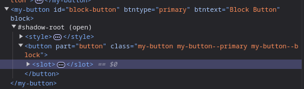
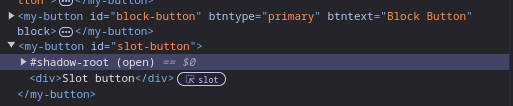

# Web Components: An Introduction

In modern web development, frameworks are all the rage. Almost all modern frameworks have the concept of components.  The idea behind components is breaking your frontend logic down into smaller reusable chunks that you can share across pages or projects.  Generally these components are not reusable across other frameworks, and will require a build process for compiling them down to JavaScript that can run in the browser.  

What if I told you there was a way to build components using vanilla JavaScript and widely available browser APIs that you could share across frameworks?  This is now a reality with Web Components. Here we will take a quick look at the different types of Web Components, and some of the power we can wield with them.

## The Basics of Web Components

Web Components are defined using the [Custom Element Registry](https://developer.mozilla.org/en-US/docs/Web/API/Window/customElements). This is an API that most modern browsers supply. To create a Web Component, you simply define it in code and then register it in the Custom Element Registry. Once it's registered and defined using the right naming conventions, the component is available for use within the page.

```JavaScript
customElements.define("my-component", MyComponentClass);
```

### Types of Web Components

Web Components can be broken down into [two different categories](https://developer.mozilla.org/en-US/docs/Web/API/Web_components/Using_custom_elements). These are **Autonomous Web Components** and **Custom Built-In Elements**.  

**Autonomous Web Components** are an extension of the generic [HTMLElement](https://developer.mozilla.org/en-US/docs/Web/API/HTMLElement) class. These components are generally more flexible, as you are essentially building your own HTML element with the power to customize all behavior from the ground up. This includes the root element used for rendering the component.  Once defined, you use Autonomous Web Components just like any other HTML element.

```HTML
<my-button class="example-component">Button text</my-button>
```

**Custom Built-In Elements** extend specific HTML elements.  For example, you may extend the [HTMLButtonElement](https://developer.mozilla.org/en-US/docs/Web/API/HTMLButtonElement) class or the [HTMLAnchorElement](https://developer.mozilla.org/en-US/docs/Web/API/HTMLAnchorElement).  These are meant to augment the functionality of existing HTML elements. To use a Custom Built-In element, you use the "is" attribute on the HTML element you are augmenting to tell it that it is an instance of the Web Component.

```HTML
<button is="my-button" class="example-component">Button text</button>
```

### Naming Web Components

When defining a Web Component, there are [certain conventions](https://html.spec.whatwg.org/multipage/custom-elements.html#valid-custom-element-name) that must be followed.  

Generally you will name your components similar to HTML elements with your own prefix attached to keep things simple (i.e. \<my-button>).  The basic rules require that the element name start with a lowercase letter, and it must include a hyphen.  These guidelines will get you by for most cases, but I would recommend looking at the [HTML spec](https://html.spec.whatwg.org/multipage/custom-elements.html#valid-custom-element-name) if you're curious about all rules.

```HTML
<!--Valid-->
<my-button/>
<your-button/>

<!--Invalid-->
<My-button/>
<1234-button/>
<Mybutton/>
```

### Lifecycle Hooks

Web components have specific [lifecycle hooks](https://developer.mozilla.org/en-US/docs/Web/API/Web_components/Using_custom_elements#implementing_a_custom_element) that are used for reacting to different phases that the component goes through.  The hooks are the following:

- connectedCallback -> Runs when the component is attached to the DOM.
- disconnectedCallback -> Runs when the component is detached from the DOM.
- adoptedCallback -> Runs each time the component is attached to a new DOM.
- attributeChangedCallback -> Runs when an attribute from the list of "observedAttributes" updates.

```JavaScript
class MyComponent extends HTMLElement {
    static observedAttributes = ["btntype"]
    connectedCallback() {
        // Handle when the component is attached to the DOM
    }
    disconnectedCallback() {
        // Handle when the component is removed from the DOM
    }
    adoptedCallback() {
        // Handle when the component is attached to a new DOM
    }
    attributeChangedCallback(name, oldValue, newValue) {
        // Trigged when the "btntype" attribute is changed since it is in the list of observedAttributes.
        // "name" will be the name of the attribute that changed.
        // "oldValue" is the value before the change.
        // "newValue" is the new value after the change.
    }
}
```

These lifecycle hooks are used for doing any initialization or cleanup work required when creating/destroying component instances. The [attributeChangedCallback](https://developer.mozilla.org/en-US/docs/Web/API/Web_components/Using_custom_elements#responding_to_attribute_changes) is especially useful, as it allows to react to attribute value updates.  Web Components have a special static attribute called "observedAttributes", which is meant to be an array of attribute names (strings) that will trigger the attributeChangedCallback. 

### The Shadow DOM

The [Shadow DOM](https://developer.mozilla.org/en-US/docs/Web/API/Web_components/Using_shadow_DOM) is probably the most confusing and controversial part of Web Components.  The Shadow DOM is essentially a separately scoped piece of the DOM that lives within a Web Component. Any Styles you define within the Shadow DOM are scoped within the Shadow DOM an do not pollute the rest of the document.  Any styles defined in the "Light DOM" (the rest of the document) do not penetrate the Shadow DOM (CSS variables are an exception, but we won't get into that here).

The Shadow DOM is mainly a concern for Autonomous Web Components since Custom Built-In elements are just adding to existing HTML elements.  For Autonomous Web Components, the custom tag representing the element (i.e. \<my-button></my-button>) is considered the "host" element. Within the host element is the "shadow root". Within the shadow root is where the markup for the component is rendered.

Here is an example where you will see the the "my-button" element as the host, with the Shadow DOM inside.



When building web components, there are two modes you can set the Shadow DOM to. These modes are "open" and "closed". Open Shadow DOMs can be accessed with JavaScript outside the Shadow Root in the Light DOM, while closed Shadow DOMs cannot.

```JavaScript
class MyComponent extends HTMLElement {
    constructor() {
        const shadow = this.attachShadow({ mode: "open" }); // open or closed.
    }
}
```

### Templates and Slots
Templates and slots are tools that can be used in combination with the Shadow DOM to enhance web components. Templates are used for creating reusable snippets within Web Components, while slots are used for exposing "holes" that content from the Light DOM can be passed into.  

Templates are handy if there is a snippet of HTML that you need to render over and over again within a Web Component. They can also be used outside Web Components, but have more limited use cases. 

Slots are used for passing content from the Light DOM into a Web Component. This is handy if you have a generic compnoent that may require dynamic content to get passed in. A good example may be a generic card component, where you could have a slot exposed to pass markup into the body of the card.

Slots and the Shadow DOM have a unique interaction that is worth noting.  Slots can have default content that renders in the event that nothing is passed in. Content passed into slots lives within the Light DOM and is "shallow copied" into the Shadow DOM.  You can see this visually in the browser inspector. The slot content will render within the web component, but in the DOM, the content technically lives outside the web component and provides a link to the slot.



This being said, that means all slot content is styled and referenced just like any other content within the Light DOM. Styles within the Light DOM will impact slot content, while Shadow DOM styles will not.  There are APIs available for interacting with slot content from within the web component.

## Basic Examples

To see some examples of some basic components in action, I recommend taking a look at the GitHub repo hosting this article. You can clone the repo and play around with the examples.

You can also take a look at some Code Pens I've put together:
- [Autonomous Web Component Example](https://codepen.io/kpmcdowellmo/pen/zxOdWvZ)
- [Custom Built-In Element Example](https://codepen.io/kpmcdowellmo/pen/dPbzmYm)
- [Basic Templates Example](https://codepen.io/kpmcdowellmo/pen/WbeEzre)